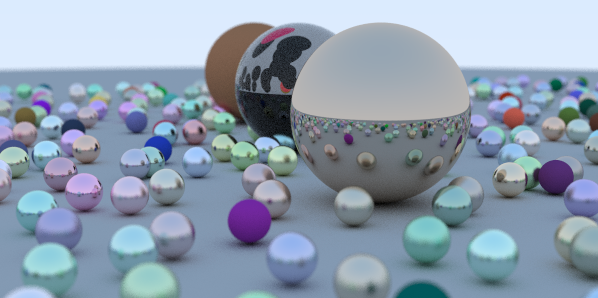

Rust Raytracer
--
by [@michalbe](http://github.com/michalbe), based on a [Raytracing in one weekend](https://github.com/petershirley/raytracinginoneweekend) book by Peter Shirley.

## Run
```
time cargo run --release > result.ppm
```

## Result

